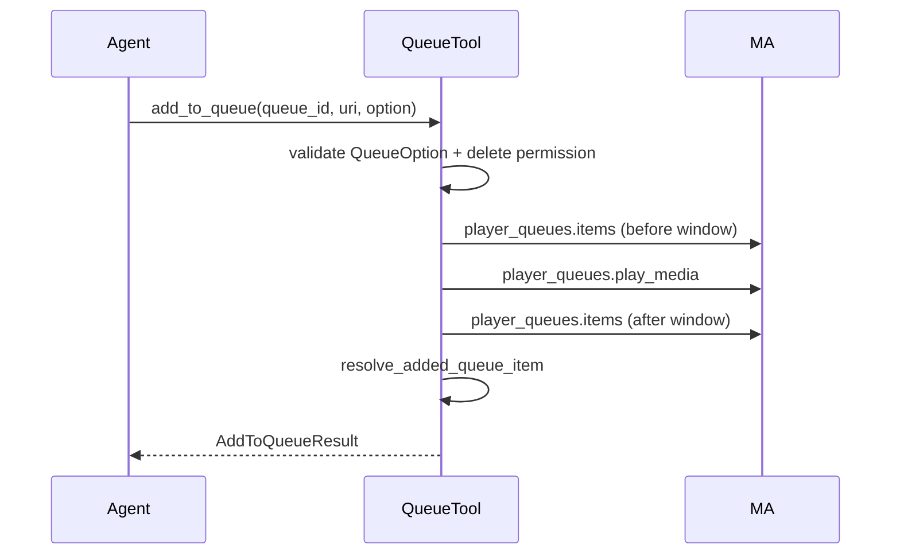

## Problem Statement

Agents can start playback via ``playback_play_media`` but have no dedicated way
to enqueue media without interrupting what is already playing. Queue placement
modes (append, play next, replace) exist in Music Assistant but are not exposed
through MCP, forcing agents to guess controller APIs or misuse playback tools.

## Solution Summary

Add ``queue_add_to_queue`` under the ``edit:queue`` permission with explicit
``option`` values mapped to MA ``QueueOption``. Return ``AddToQueueResult`` so
callers can confirm the new row before chaining adds. Gate ``replace`` /
``replace_next`` on ``delete:queue``, mark the tool destructive, and resolve the
added row via id-diff with a tail window for long queues.

## Acceptance Criteria

1. ``add_to_queue`` accepts ``add``, ``next``, ``play``, ``replace_next``, and
   ``replace``; invalid options raise ``ToolError`` listing valid values.
2. Default ``option`` is ``add``; the call forwards to
   ``player_queues.play_media`` with the matching ``QueueOption``.
3. Successful adds return ``AddToQueueResult`` with ``item_id``, ``uri``,
   ``name``, and ``option``.
4. ``replace`` and ``replace_next`` require ``delete:queue`` when that
   permission is disabled on the runtime.
5. Row detection prefers newly created ``queue_item_id`` values; album URIs
   that expand to track rows are detected by id-diff, not input URI match.
6. Queues longer than 500 items use a tail window offset when locating appended
   rows.

## Test Plan

- ``tests/test_add_to_queue.py`` — valid/invalid options, default, ack payload,
  id-diff for duplicates and album expansion, tail window, delete permission gate.
- ``tests/test_annotations.py`` — ``queue_add_to_queue`` listed as destructive.
- Manual: call ``queue_add_to_queue`` with a track URI and ``option=add`` while
  playback is active; confirm current item keeps playing and the new row appears
  at the queue tail.

## Sequence Diagram

